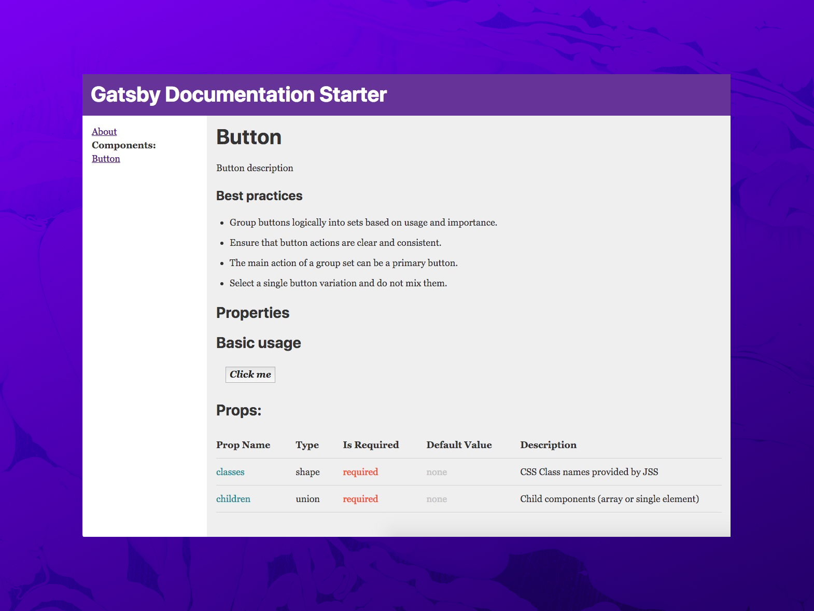

# Gatsby Documentation Starter

Automatically generate documentation for your project using MDX, react-docgen, and GatsbyJS.

## Features

- 📝 [MDX](https://github.com/mdx-js/mdx) - Write your documentation in Markdown and include React components using JSX!
- ♻️ [react-docgen](https://github.com/reactjs/react-docgen) - Automatically parses all your React components (functional, stateful, even stateless!) for JS Docblocks and Prop Types.
- ⚛️ [GatsbyJS](http://gatsby.org) - Creates local GraphQL server to build static version of documentation (easily deployed on a CDN or GHPages, Netlify, etc)
- 🗄 Props Table - Component for displaying component props in a table format
- 🎛 Modular - Easily install inside existing projects!
- ⚖️ Lightweight - Only what you need, no extra dependencies.

## Quick Start

**Install with Netlify**

1. [](https://app.netlify.com/start/deploy?repository=https://github.com/whoisryosuke/gatsby-documentation-starter/tree/example)


**Install with Gatsby CLI**

1. `gatsby new docs https://github.com/whoisryosuke/gatsby-documentation-starter/`

**Custom install**

1. `git clone https://github.com/whoisryosuke/gatsby-documentation-starter.git`
1. Update `gatsby-config.js` with the location of your components + MDX _(see: "Changing source folder")_
1. `npm install` inside project
1. `npm run develop`
1. View your documentation: http://localhost:8000

Check out the [example branch](https://github.com/whoisryosuke/gatsby-documentation-starter/tree/example) to see the source code of [the demo](https://gatsby-documentation-starter.netlify.com/).

### Creating documentation

Documentation is sourced from two places: component source code and MDX files.

```
src
└── components
    └── Button
        ├── Button.js
        └── Button.mdx
```

**React-docgen** grabs any JS Docblocks you write for your React classes/functions (`Button.js`), as well as the Prop Types. These are displayed on your documentation page, with the props displayed in a table.

Inside your **MDX** file you can write additional documentation with JSX examples. You can also specify the page slug here (a **page name** and **category**). Your pages will be generated as `http://yoursite.com/<category>/<pageName>`.

In order for your component data to show up, you need an MDX file for the component - and the page name and component name in the docblock need to match.

```js
/**
 * ComponentTitle
**/
class ComponentName extends React.Component {}
```

```md
---
name: ComponentTitle
menu: CategoryName
---
```

> Creates a page for the component located at http://localhost:8000/categoryname/componentname

## Documentation

## Customizing sidebar navigation

The sidebar navigation is generated from two places: a JSON config with static pages, and component MDX files. The static pages are displayed before the components.

To customize the static pages, go to `gatsby-config.js` and edit the `sidebar` object inside the `siteMetadata` config. Each page is represented as an object with a slug (the URL) and title:

```json
  siteMetadata: {
    title: 'Gatsby Documentation Starter',
    sidebar: {
      pages: [
        {
          slug: '/about',
          title: 'about',
        },
      ],
    },
  },
```

The component pages in the navigation are automatically generated by querying all components with MDX files. If you want to change this, see section: _"Creating pages from react-docgen"_

You can override all of this functionality inside `components/sidebar.js`.

### Changing source folder

Add the relative location of your components and MDX files in `gatsby-config.js`. The default configuration is set to the `/src/components/` folder of your root project (which ideally should document every component):

```js
    {
      resolve: `gatsby-source-filesystem`,
      options: {
        name: `components`,
        path: `../src/components/`,
      },
    },
```

Gatsby will load all the JS and MDX files inside this folder. Then using the "transformer" plugins, Gatsby creates GraphQL endpoints for both components and MDX (`allMdx` and `allComponentMetadata`).

> You can add as many file sources as you need. The transformer plugins will automatically group content based on their format (JS, MDX, etc), and it uses **all** the content that's loaded.

### Adding to existing projects

This project is designed to be embedded inside existing projects.

1. `git clone` this repo into your project as a `docs` subfolder.
2. Optionally change the folder where components are loaded from _(see "Changing source folder")_
3. `npm install && npm run develop`

### Creating pages from react-docgen

This template is setup to generate pages based off MDX files in your project. This allows you to create a `Button.mdx` to document your `<Button />`. 

> It's not required to make pages based off MDX. You can use Gatsby's default routing configuration, which creates pages based on any `.js` files located in the `pages` subfolder.

If you don't plan on having MDX files for each component, you can easily swap over to using `react-docgen` data to generate pages. That way, you're ensured a documentation page for each component (instead of MDX file). _This isn't the only option either, Gatsby's flexibility allows you to use both `react-docgen` and MDX files if you wanted the best of both worlds_

`gatsby-node.js`:

```js
/**
 * Implement Gatsby's Node APIs in this file.
 *
 * See: https://www.gatsbyjs.org/docs/node-apis/
 */

const path = require('path')
const componentWithMDXScope = require('gatsby-mdx/component-with-mdx-scope')

exports.createPages = ({ graphql, actions }) => {
  const { createPage } = actions
  return new Promise((resolve, reject) => {
    resolve(
      graphql(
        `
          {
            allComponentMetadata {
              edges {
                node {
                  id
                  displayName
                  docblock
                  doclets
                  childrenComponentProp {
                    name
                    docblock
                    required
                    type {
                      value
                    }
                    defaultValue {
                      value
                      computed
                    }
                  }
                  composes
                }
              }
            }
          }
        `
      ).then(result => {
        if (result.errors) {
          console.log(result.errors)
          reject(result.errors)
        }
        // Create blog posts pages.
        result.data.allComponentMetadata.edges.forEach(async ({ node }) => {
          createPage({
            path: `/components/${node.displayName.toLowerCase()}`,
            component: componentWithMDXScope(
              path.resolve('./src/templates/posts.js'),
              node.code.scope
            ),
            context: {
              id: node.id,
              name: node.displayName,
            },
          })
        })
      })
    )
  })
}
```

We query the components through the `react-docgen` endpoint and use those to generate pages (instead of MDX files). Then we alter the page template to query MDX by name _(located in the Markdown 'frontmatter')_, and component by ID (the vice versa of it's default setup):

`templates/posts.js`:

```js
import React, { Component } from 'react'
import { graphql } from 'gatsby'
import MDXRenderer from 'gatsby-mdx/mdx-renderer'
import { MDXProvider } from '@mdx-js/tag'

import Layout from '../components/layout'
import PropsTable from '../components/propstable'

export default class MDXRuntimeTest extends Component {
  render() {
    const { children, data, tableOfContents } = this.props
    return (
        <MDXProvider>
          <Layout>
            <div className="content">
              {children}
              <h1>{data.componentMetadata.displayName}</h1>
              <p>{data.componentMetadata.docblock}</p>
              <MDXRenderer tableOfContents={tableOfContents}>
                {data.mdx.code.body}
              </MDXRenderer>
              <h2 style={{ marginTop: '2rem' }}>Props:</h2>
              <PropsTable
                propMetaData={data.componentMetadata.childrenComponentProp}
              />
            </div>
          </Layout>
        </MDXProvider>
    )
  }
}

export const pageQuery = graphql`
  query($id: String!, $name: String!) {
    mdx(frontmatter: { name: { eq: $name } }) {
      id
      code {
        body
      }
      tableOfContents
    }
    componentMetadata(id: { eq: $id }) {
      id
      displayName
      docblock
      doclets
      childrenComponentProp {
        name
        docblock
        required
        parentType {
          name
        }
        type {
          value
        }
        defaultValue {
          value
          computed
        }
      }
      composes
    }
  }
`
```

## Credits

- [GatsbyJS](http://gatsby.org)
- [gatsby-mdx](https://github.com/ChristopherBiscardi/gatsby-mdx/)
- [gatsby-transformer-react-docgen](https://github.com/gatsbyjs/gatsby/tree/master/packages/gatsby-transformer-react-docgen)
- [gatsby-transformer-remark](https://github.com/gatsbyjs/gatsby/tree/master/packages/gatsby-transformer-remark)
- [Style Guide Guide](http://bradfrost.github.io/style-guide-guide/)
- [Mobile Button CSS](https://codepen.io/ainalem/pen/LJYRxz)
